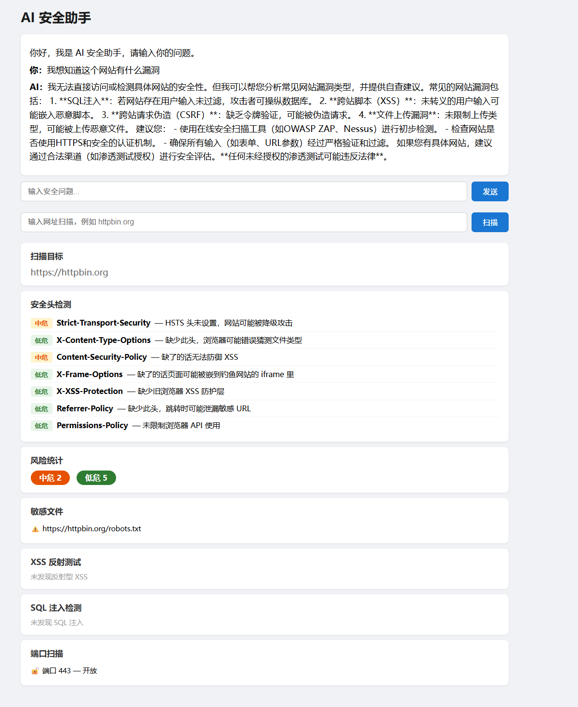

# AI安全助手

## 介绍
这个AI安全助手旨在帮助用户分析网站的安全问题

## 技术栈
后端 Python + FastAPI，前端 HTML + CSS + JavaScript，AI DeepSeek API，安全扫描 requests库

## 功能
- 安全头检测
- 敏感文件泄露检测
- XSS 漏洞检测
- SQL 注入检测
- 开放端口检测
- Cookie 安全检测
- 开放式重定向检测

## 运行方式
pip install -r requirements.txt  
uvicorn server:app --reload
打开 http://127.0.0.1:8000/static/index.html

## 截图
